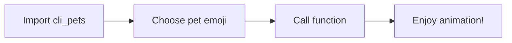

# MkDocs Material Setup Guide for cli-pets

This guide will help you set up MkDocs with Material theme for the cli-pets package documentation.

## Overview

**MkDocs** is a static site generator for creating documentation websites.
**Material for MkDocs** is a powerful theme that transforms MkDocs with modern design and enhanced functionality including:
- Modern, responsive Material Design interface
- Dark/light mode toggle
- Advanced search capabilities
- Code syntax highlighting
- Content tabs, admonitions, and diagrams
- Blog posts and social cards
- And much more...

**R Analog:** pkgdown (converts R package documentation to websites)

## Prerequisites

✅ Already installed in your project:
- `mkdocs-material>=9.6.21` (in pyproject.toml)

You'll also need:
- Python 3.12+ (your project requires this)
- Visual Studio Code (or any IDE)
- GitHub Account (for GitHub Pages deployment)

## Initial Setup

### 1. Activate Virtual Environment

```bash
# On Windows
.\venv\Scripts\activate

# Or if using uv (recommended for this project)
uv sync
```

### 2. Create MkDocs Project Structure

```bash
# Create new MkDocs project in current directory
mkdocs new .
```

This creates:
- `docs/` folder for documentation files
- `mkdocs.yml` configuration file
- `docs/index.md` homepage

### 3. Basic Configuration

Create or replace `mkdocs.yml` with:

```yaml
site_name: CLI Pets Documentation
site_url: https://ran-codes.github.io/cli-pets
site_description: Animated terminal pets for your command line
site_author: rl627

theme:
  name: material
```

### 4. Test Local Server

```bash
mkdocs serve
```

Visit http://localhost:8000 to see your documentation.

## Enhanced Configuration

### Enable YAML Schema Validation (VSCode)

1. Install **Red Hat YAML** extension in VSCode
2. Open VSCode settings.json (Ctrl+Shift+P → "Preferences: Open User Settings (JSON)")
3. Add this configuration:

```json
{
  "yaml.schemas": {
    "https://squidfunk.github.io/mkdocs-material/schema.json": "mkdocs.yml"
  },
  "yaml.customTags": [
    "!ENV scalar",
    "!ENV sequence",
    "!relative scalar",
    "tag:yaml.org,2002:python/name:material.extensions.emoji.to_svg",
    "tag:yaml.org,2002:python/name:material.extensions.emoji.twemoji",
    "tag:yaml.org,2002:python/name:pymdownx.superfences.fence_code_format"
  ]
}
```

Now you'll get autocomplete and validation for mkdocs.yml!

## Recommended Configuration for cli-pets

Here's a comprehensive `mkdocs.yml` tailored for cli-pets:

```yaml
site_name: CLI Pets Documentation
site_url: https://ran-codes.github.io/cli-pets
site_description: Animated terminal pets for your command line
site_author: rl627
repo_url: https://github.com/ran-codes/cli-pets
repo_name: ran-codes/cli-pets

theme:
  name: material

  # Color scheme
  palette:
    # Dark mode
    - scheme: slate
      toggle:
        icon: material/weather-sunny
        name: Switch to light mode
      primary: teal
      accent: lime

    # Light mode
    - scheme: default
      toggle:
        icon: material/weather-night
        name: Switch to dark mode
      primary: green
      accent: amber

  # Fonts
  font:
    text: Roboto
    code: Fira Code

  # Logo and favicon
  icon:
    logo: material/emoticon-happy-outline
    repo: fontawesome/brands/github

  # Features
  features:
    - navigation.footer
    - navigation.top
    - navigation.tabs
    - search.suggest
    - search.highlight
    - content.code.copy
    - content.code.annotate

# Extensions
markdown_extensions:
  # Code blocks
  - pymdownx.highlight:
      anchor_linenums: true
      line_spans: __span
      pygments_lang_class: true
  - pymdownx.inlinehilite
  - pymdownx.snippets
  - pymdownx.superfences:
      custom_fences:
        - name: mermaid
          class: mermaid
          format: !!python/name:pymdownx.superfences.fence_code_format

  # Content tabs
  - pymdownx.tabbed:
      alternate_style: true

  # Admonitions
  - admonition
  - pymdownx.details

  # Emojis and icons
  - attr_list
  - pymdownx.emoji:
      emoji_index: !!python/name:material.extensions.emoji.twemoji
      emoji_generator: !!python/name:material.extensions.emoji.to_svg

# Navigation
nav:
  - Home: index.md
  - Getting Started:
      - Installation: getting-started/installation.md
      - Quick Start: getting-started/quickstart.md
  - API Reference:
      - greet(): api/greet.md
      - walk(): api/walk.md
      - race(): api/race.md
  - Examples:
      - Basic Usage: examples/basic.md
      - Advanced: examples/advanced.md
  - About:
      - Contributing: about/contributing.md
      - License: about/license.md

# Footer
extra:
  social:
    - icon: fontawesome/brands/github
      link: https://github.com/ran-codes/cli-pets

copyright: Copyright &copy; 2024 rl627

# Plugins
plugins:
  - search
```

## Project Structure

Create this documentation structure:

```
cli-pets/
├── docs/
│   ├── index.md                    # Homepage
│   ├── getting-started/
│   │   ├── installation.md
│   │   └── quickstart.md
│   ├── api/
│   │   ├── greet.md
│   │   ├── walk.md
│   │   └── race.md
│   ├── examples/
│   │   ├── basic.md
│   │   └── advanced.md
│   ├── about/
│   │   ├── contributing.md
│   │   └── license.md
│   └── assets/                     # For images, logos, etc.
│       ├── logo.png (optional)
│       └── favicon.ico (optional)
├── mkdocs.yml
└── pyproject.toml
```

## Key Features to Use

### 1. Code Blocks with Syntax Highlighting

````markdown
```python title="example.py" linenums="1" hl_lines="2-3"
from cli_pets import walk

# Animate a dog walking 20 steps
walk(pet='🐕', steps=20, speed=0.05)
```
````

### 2. Content Tabs

```markdown
=== "Python"

    ```python
    from cli_pets import greet
    greet(pet='🐱')
    ```

=== "Command Line"

    ```bash
    python -c "from cli_pets import greet; greet(pet='🐱')"
    ```
```

### 3. Admonitions (Callouts)

```markdown
!!! note "Installation Tip"
    Use `uv` for faster dependency management!

!!! warning
    Animations may not work properly in all terminal emulators.

??? info "Did you know?"
    This is a collapsible callout!
```

### 4. Diagrams with Mermaid

````markdown

````

### 5. Emojis and Icons

```markdown
:octicons-terminal-16: CLI Pets supports these functions:

- :material-party-popper: `greet()` - Greet with animated pets
- :material-walk: `walk()` - Animate pets walking
- :material-run-fast: `race()` - Race multiple pets
```

Browse icons at: https://squidfunk.github.io/mkdocs-material/reference/icons-emojis/

## Building and Testing

### Local Development

```bash
# Start development server with live reload
mkdocs serve

# Open http://127.0.0.1:8000
```

### Build Static Site

```bash
# Build the documentation
mkdocs build

# Output will be in site/ folder
```

## Deploy to GitHub Pages

### 1. Create GitHub Actions Workflow

Create `.github/workflows/ci.yml`:

```yaml
name: Deploy MkDocs to GitHub Pages

on:
  push:
    branches:
      - main
      - master

permissions:
  contents: write

jobs:
  deploy:
    runs-on: ubuntu-latest
    steps:
      - uses: actions/checkout@v4

      - name: Configure Git Credentials
        run: |
          git config user.name github-actions[bot]
          git config user.email 41898282+github-actions[bot]@users.noreply.github.com

      - uses: actions/setup-python@v5
        with:
          python-version: 3.x

      - run: echo "cache_id=$(date --utc '+%V')" >> $GITHUB_ENV

      - uses: actions/cache@v4
        with:
          key: mkdocs-material-${{ env.cache_id }}
          path: .cache
          restore-keys: |
            mkdocs-material-

      - run: pip install mkdocs-material

      - run: mkdocs gh-deploy --force
```

### 2. Enable GitHub Pages

1. Push your code to GitHub
2. Go to repository **Settings** → **Pages**
3. Under "Source", select **Deploy from a branch**
4. Choose branch: **gh-pages** (root)
5. Save

Your site will be available at: `https://ran-codes.github.io/cli-pets/`

## Next Steps

1. ✅ Set up basic MkDocs configuration
2. 📝 Create documentation pages for each function (greet, walk, race)
3. 📸 Add screenshots/GIFs of pet animations
4. 🎨 Customize theme colors and logo
5. 🚀 Deploy to GitHub Pages
6. 📚 Add code examples and tutorials
7. 🔧 Set up API reference with docstrings

## Resources

- [Material for MkDocs Documentation](https://squidfunk.github.io/mkdocs-material/)
- [MkDocs Documentation](https://www.mkdocs.org/)
- [James Willett Tutorial](https://github.com/james-willett/material-mkdocs-youtube-2024)
- [YouTube Video Tutorial](https://www.youtube.com/watch?v=xlABhbnNrfI)
- [Emoji Cheat Sheet](https://squidfunk.github.io/mkdocs-material/reference/icons-emojis/)

## Troubleshooting

### Issue: `mkdocs: command not found`
**Solution**: Make sure you've activated your virtual environment and installed dependencies with `uv sync`

### Issue: Changes not showing
**Solution**: The dev server has live reload. If it's not working, stop and restart `mkdocs serve`

### Issue: GitHub Pages not updating
**Solution**: Check the Actions tab in your GitHub repository for build errors

### Issue: Code highlighting not working
**Solution**: Ensure you've added the `pygments` markdown extensions to `mkdocs.yml`

---

**Ready to get started?** Run `mkdocs serve` and begin documenting your CLI Pets package!
